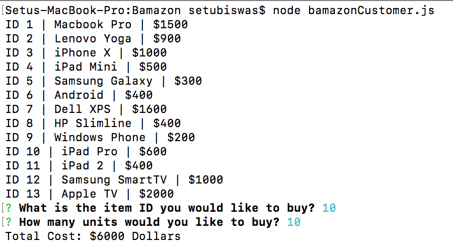
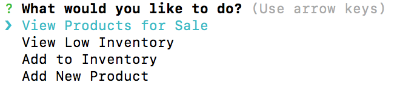
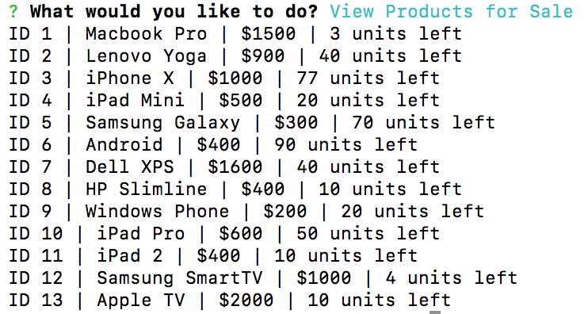
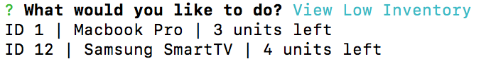
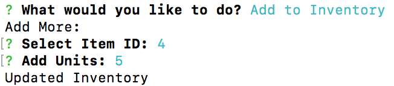
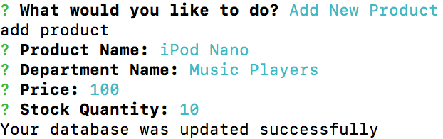

# Bamazon

## Project: A simulation of an e-commerce store like Amazon using the node.

## Challenge 1: Customer View

In this scenario, we are going to look at the application from a customer's point of view.  When the node application runs, it will display the information that is loaded in the MySQL database.  The application will list the following columns:

	* item_ID (unique ID for each product)
	* product_name (Nam of product)
	* price (cost to customer)

Once the products are displayed, the customer will be given a prompt on which item to buy.  They must select the item by its corresponding ID number.  After the ID is chosen, another prompt will ask the customer how many units of the product they would like to purchase.  When the customer enters a quantity, the application calculates the total cost and displays it to the customer.  On the back end, the application removes the units from the MySQL database.

## Challenge 2: Manager View

In the second scenario, we are going to look at the application from a manager's point of view.  This time, the application will prompt the manager and give 4 options to select.  Each choice will perform a different set of actions with the data from the MySQL server.

1.  View Products for Sale

	* The node application displays all of the products stored in the MySQL database.  This will include the Item ID, Product Name, Price, and Stock Quantity.

2.  View Low Inventory

	* The node application will only display items where there are less than 5 units remaining in stock.

3.  Add Inventory

	* The manager will be prompted to select the product by the Item ID and must enter how many units to add to the inventory.  The application then adds the number and updates the MySQL with the new quantity.

4.  Add New Product

	* The node application will create a new row in the MySQL database and enter a new product.  The manager is prompted to enter all relevant information.  Then the database gets updated from the inputs.

